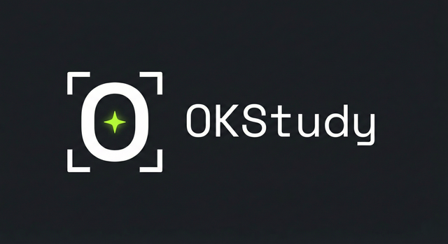

  

# OKStudy

> **Make studying OK again** ✨

Minimalistyczna wtyczka Chrome do wspomagania nauki, oparta o **Gemini Vision API**. Robi zrzut ekranu, analizuje treść zadania i pomaga je zrozumieć.

## 🎓 Tryby działania

Wtyczka ma dwa tryby (przełączane w ustawieniach, wybór zapisuje się na stałe):

- **🎓 Tłumacz** *(domyślny)* - wyjaśnia **krok po kroku**, jak rozwiązać zadanie, i pokazuje czytelne wytłumaczenie na dole ekranu. Tryb edukacyjny.
- **⚡ Express** - pokazuje samą, zwięzłą odpowiedź, dyskretnie w rogu.

## ✨ Skróty klawiszowe

- ⚡ **Alt+O** - Szybka analiza (bez internetu)
- 🌐 **Alt+I** - Analiza z wyszukiwaniem Google
- 🔁 **Alt+P** - Powtórz odpowiedź (naciskaj = starsze odpowiedzi, **przytrzymaj** = kopiuj do schowka)
- ✕ **Alt+K** - Przerwij / kasuj bieżącą analizę
- 🔄 **Alt+M** - Przełącz model Flash ⇄ Pro *(skrót trzeba przypisać ręcznie - patrz niżej)*

### Obsługiwane typy zadań:
- ✅ Pytania zamknięte (A/B/C/D)
- ✅ Wielokrotny wybór (wiele poprawnych odpowiedzi)
- ✅ Prawda/Fałsz
- ✅ Pytania otwarte (liczby, tekst, obliczenia)

## 📦 Instalacja

1. Pobierz najnowszą wersję z [Releases](https://github.com/OktawiuszKapica/OKStudy/releases)
2. Rozpakuj archiwum ZIP
3. Otwórz Chrome i wejdź w `chrome://extensions/`
4. Włącz **Tryb dewelopera** (prawy górny róg)
5. Kliknij **Załaduj rozpakowane** i wybierz folder `okstudy`

## ⚙️ Konfiguracja

1. Kliknij ikonę wtyczki lub wejdź w opcje
2. Wklej swój klucz API Gemini ([pobierz tutaj](https://aistudio.google.com/apikey))
3. Wybierz model (Gemini 3.5 Flash lub 3.1 Pro)
4. Wybierz tryb działania (🎓 Tłumacz lub ⚡ Express)
5. Zapisz

## 🎯 Jak używać

1. Otwórz stronę z testem/quizem
2. Naciśnij **Alt+O** (szybka analiza) lub **Alt+I** (z wyszukiwaniem)
3. Poczekaj na odpowiedź
4. Jeśli chcesz zobaczyć odpowiedź ponownie - **Alt+P** (kolejne naciśnięcia pokazują starsze, do 5 wstecz)
5. Przytrzymaj **Alt+P**, aby skopiować odpowiedź do schowka 📋
6. Jeśli analiza poszła w złe miejsce lub się zacięła - **Alt+K** (przerywa)

## ⌨️ Skrót przełączania modelu (Alt+M)

Chrome pozwala wtyczce zasugerować maksymalnie **4 skróty**, dlatego przełączanie
modelu trzeba przypisać samodzielnie (raz):

1. Wejdź w `chrome://extensions/shortcuts`
2. Znajdź **OKStudy → "Przełącz model Flash/Pro"**
3. Kliknij pole i naciśnij np. **Alt+M**

Po przełączeniu na ekranie pojawi się na chwilę ⚡ Flash lub 🧠 Pro.

## 🌐 Tryb z internetem (Alt+I) a darmowy klucz

Wyszukiwanie Google (grounding) w API Gemini jest dostępne **tylko na płatnym
kluczu**. Na darmowym kluczu `Alt+I` automatycznie wykona analizę **bez
wyszukiwania**, żebyś i tak dostał odpowiedź zamiast błędu.

## 🔧 Wymagania

- Google Chrome lub przeglądarka oparta na Chromium (Edge, Brave, Opera)
- Klucz API Google Gemini

## 📝 Changelog

### v1.2.1
- 🐛 **Naprawka pozycji przy zoomie** - dymek nie ucieka poza ekran przy powiększeniu przeglądarki innym niż 100% (np. 125%, 150%)
- 🆘 **Zapasowy skrót analizy** - jeśli Alt+O koliduje z inną wtyczką, można w `chrome://extensions/shortcuts` ustawić własny (np. Alt+A) dla „Szybka analiza - zapasowy skrót"
- 💬 **Widoczny komunikat**, gdy nie uda się zrobić zrzutu (zamiast cichego braku reakcji)

### v1.2.0
- 🎓 **Tryb Tłumacz** (domyślny) - wyjaśnienie krok po kroku zamiast samej odpowiedzi, czytelny panel na dole ekranu
- ⚡ **Tryb Express** - dotychczasowe zachowanie (sama odpowiedź, dyskretnie) jako opcja
- 🔘 Przełącznik trybu w ustawieniach (zapisywany na stałe)
- 🧼 Mniej śladów w przeglądarce (wyciszone logi, neutralne nazwy w DOM)
- ⏱️ Limit czasu zapytania (auto-przerwanie po 30 s zamiast zawieszenia)

### v1.1.0
- 🆕 **Alt+K** - przerywanie / kasowanie bieżącej analizy (anuluje też zapytanie do API w locie)
- 🆕 **Alt+M** - przełączanie modelu Flash/Pro w locie (skrót przypisywany ręcznie)
- 🆕 **Historia odpowiedzi** - kolejne naciśnięcia Alt+P cofają się do 5 odpowiedzi wstecz
- 🆕 **Kopiowanie** - przytrzymanie Alt+P kopiuje odpowiedź do schowka
- 🆕 **Test klucza API** w ustawieniach (przycisk „Sprawdź klucz")
- 🆕 **Klik w ikonę** otwiera ustawienia
- 🛡️ **Internet (Alt+I)** automatycznie przechodzi w tryb bez wyszukiwania na darmowym kluczu
- 💬 **Czytelne komunikaty błędów** (zły klucz, brak dostępu, limit zapytań, niedostępny model)
- ⬆️ Aktualizacja modeli: **Gemini 3.5 Flash** (domyślny) i **Gemini 3.1 Pro**
- 🔄 Automatyczna migracja starych ustawień modeli
- 🧹 Drobne porządki w repozytorium

### v1.0.0
- Pierwsza publiczna wersja
- Analiza zrzutów ekranu przez Gemini 3
- Obsługa wielu typów pytań
- Tryb szybki i z wyszukiwaniem
- Funkcja powtarzania odpowiedzi

## 👨‍💻 Autor

**Oktawiusz Kapica**

- 🌐 Portfolio: [OktawiuszKapica.pl](https://oktawiuszkapica.pl)
- 💻 GitHub: [@OktawiuszKapica](https://github.com/OktawiuszKapica)
- ✉️ Kontakt: [hello@oktawiuszkapica.pl](mailto:hello@oktawiuszkapica.pl)

---

*OK = Oktawiusz Kapica* 😉
